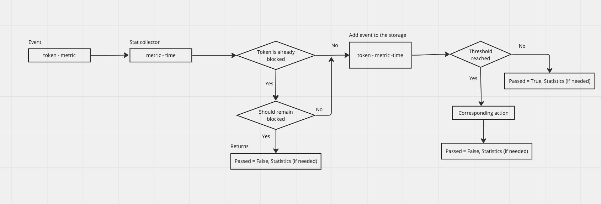

# BanHammer 

The BanHammer class is a tool for monitoring and blocking tokens based on predefined thresholds for various metrics. This class is designed to be flexible and customizable, allowing you to configure your own thresholds for each metric that you wish to monitor.

## Assumptions
1) If the token is already banned it cannot be banned again by other criteria (metric)
2) If the token is banned next action (e.g. login) will be calculated in the stats

## High-level diagram of how the code works


## Usage
To use the BanHammer class, simply import it into your Python script and create an instance of the class. You can then use the instance to monitor tokens and take appropriate actions based on predefined thresholds.
```
# Create an instance of the BanHammer class
bh = BanHammer(bans=bans, return_rates=True)

# Monitor a token and take action based on predefined thresholds
passed, stats = bh.incr(token="my_token", metric="login_attempts")
```
For more take a look at the `examples` folder.

## Complexity
`incr` -  method: This method increments the count for a given metric and token, and checks if the threshold for that metric has been reached. The time complexity of this method depends on the number of thresholds for the given metric. If there are `k` thresholds, the time complexity is `O(k)`, as it checks each threshold to see if it has been reached.  The space complexity is `O(m * k * e)`, where `m` is the number of unique tokens and `k` is the number of unique thresholds, as it creates a dictionary of metrics for each token, and a dictionary of thresholds for each metric. The `e` is the count of events that occured (timestamps).

`status_all` - the time complexity of the status_all method is `O(n * k)`, where `n` is the number of metrics and `k` is the number of epoch times for each metric

## Scalability
In this code, we used Python native dict but in terms of scaling to millions of requests per sec, we can use an in-memory distributed database here (e.g. Redis) with sharding.
For `status_all` functionality I believe there is still room for improvement.

## Run tests
```python3 -m unittest tests/unit/test_ban_hammer.py```

## Notes
`The project is done in a hurry (~4 hours limitation) so some best practices are misused and the project is not finally completed.`
1) Test coverage
2) Extendability (e.g. the stats format I would like to make extendable)
3) Wrap this into a package so it would be easy to install and use


